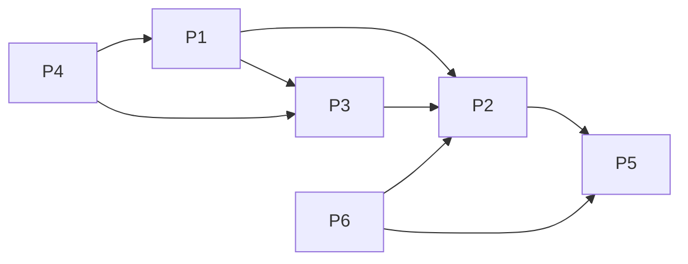

# Projects and dependencies analysis

This document provides a comprehensive overview of the projects and their dependencies in the context of upgrading to .NETCoreApp,Version=v10.0.

## Table of Contents

- [Executive Summary](#executive-Summary)
  - [Highlevel Metrics](#highlevel-metrics)
  - [Projects Compatibility](#projects-compatibility)
  - [Package Compatibility](#package-compatibility)
  - [API Compatibility](#api-compatibility)
- [Aggregate NuGet packages details](#aggregate-nuget-packages-details)
- [Top API Migration Challenges](#top-api-migration-challenges)
  - [Technologies and Features](#technologies-and-features)
  - [Most Frequent API Issues](#most-frequent-api-issues)
- [Projects Relationship Graph](#projects-relationship-graph)
- [Project Details](#project-details)

  - [sample/Sample.Api/Sample.Api.csproj](#samplesampleapisampleapicsproj)
  - [sample/Sample.Data/Sample.Data.csproj](#samplesampledatasampledatacsproj)
  - [sample/Sample.Entity/Sample.Entity.csproj](#samplesampleentitysampleentitycsproj)
  - [sample/Sample.Service/Sample.Repository.csproj](#samplesampleservicesamplerepositorycsproj)
  - [src/Fop.csproj](#srcfopcsproj)
  - [test/Fop.Tests/Fop.Tests.csproj](#testfoptestsfoptestscsproj)

## Executive Summary

### Highlevel Metrics

| Metric | Count | Status |
| :--- | :---: | :--- |
| Total Projects | 6 | All require upgrade |
| Total NuGet Packages | 9 | 5 need upgrade |
| Total Code Files | 62 |  |
| Total Code Files with Incidents | 6 |  |
| Total Lines of Code | 2035 |  |
| Total Number of Issues | 11 |  |
| Estimated LOC to modify | 0+ | at least 0.0% of codebase |

### Projects Compatibility

| Project | Target Framework | Difficulty | Package Issues | API Issues | Est. LOC Impact | Description |
| :--- | :---: | :---: | :---: | :---: | :---: | :--- |
| [sample/Sample.Api/Sample.Api.csproj](#samplesampleapisampleapicsproj) | net6.0 | 🟢 Low | 2 | 0 |  | AspNetCore, Sdk Style = True |
| [sample/Sample.Data/Sample.Data.csproj](#samplesampledatasampledatacsproj) | net6.0 | 🟢 Low | 2 | 0 |  | ClassLibrary, Sdk Style = True |
| [sample/Sample.Entity/Sample.Entity.csproj](#samplesampleentitysampleentitycsproj) | net6.0 | 🟢 Low | 0 | 0 |  | ClassLibrary, Sdk Style = True |
| [sample/Sample.Service/Sample.Repository.csproj](#samplesampleservicesamplerepositorycsproj) | net6.0 | 🟢 Low | 0 | 0 |  | ClassLibrary, Sdk Style = True |
| [src/Fop.csproj](#srcfopcsproj) | net6.0 | 🟢 Low | 1 | 0 |  | ClassLibrary, Sdk Style = True |
| [test/Fop.Tests/Fop.Tests.csproj](#testfoptestsfoptestscsproj) | net6.0 | 🟢 Low | 0 | 0 |  | ClassLibrary, Sdk Style = True |

### Package Compatibility

| Status | Count | Percentage |
| :--- | :---: | :---: |
| ✅ Compatible | 4 | 44.4% |
| ⚠️ Incompatible | 0 | 0.0% |
| 🔄 Upgrade Recommended | 5 | 55.6% |
| ***Total NuGet Packages*** | ***9*** | ***100%*** |

### API Compatibility

| Category | Count | Impact |
| :--- | :---: | :--- |
| 🔴 Binary Incompatible | 0 | High - Require code changes |
| 🟡 Source Incompatible | 0 | Medium - Needs re-compilation and potential conflicting API error fixing |
| 🔵 Behavioral change | 0 | Low - Behavioral changes that may require testing at runtime |
| ✅ Compatible | 184 |  |
| ***Total APIs Analyzed*** | ***184*** |  |

## Aggregate NuGet packages details

| Package | Current Version | Suggested Version | Projects | Description |
| :--- | :---: | :---: | :--- | :--- |
| DynamicExpresso.Core | 2.3.1 |  | [Fop.csproj](#srcfopcsproj) | ✅Compatible |
| Microsoft.AspNetCore.Mvc.NewtonsoftJson | 3.1.3 | 10.0.3 | [Sample.Api.csproj](#samplesampleapisampleapicsproj) | NuGet package upgrade is recommended |
| Microsoft.EntityFrameworkCore | 3.1.3 | 10.0.3 | [Sample.Data.csproj](#samplesampledatasampledatacsproj) | NuGet package upgrade is recommended |
| Microsoft.EntityFrameworkCore.SqlServer | 3.1.3 | 10.0.3 | [Sample.Data.csproj](#samplesampledatasampledatacsproj) | NuGet package upgrade is recommended |
| Microsoft.NET.Test.Sdk | 16.0.1 |  | [Fop.Tests.csproj](#testfoptestsfoptestscsproj) | ✅Compatible |
| Microsoft.VisualStudio.Web.CodeGeneration.Design | 3.1.2 | 10.0.2 | [Sample.Api.csproj](#samplesampleapisampleapicsproj) | NuGet package upgrade is recommended |
| System.Linq.Dynamic.Core | 1.2.24 | 1.7.1 | [Fop.csproj](#srcfopcsproj) | NuGet package contains security vulnerability |
| xunit | 2.4.0 |  | [Fop.Tests.csproj](#testfoptestsfoptestscsproj) | ✅Compatible |
| xunit.runner.visualstudio | 2.4.0 |  | [Fop.Tests.csproj](#testfoptestsfoptestscsproj) | ✅Compatible |

## Top API Migration Challenges

### Technologies and Features

| Technology | Issues | Percentage | Migration Path |
| :--- | :---: | :---: | :--- |

### Most Frequent API Issues

| API | Count | Percentage | Category |
| :--- | :---: | :---: | :--- |

## Projects Relationship Graph

Legend:
📦 SDK-style project
⚙️ Classic project

## Project Details

